
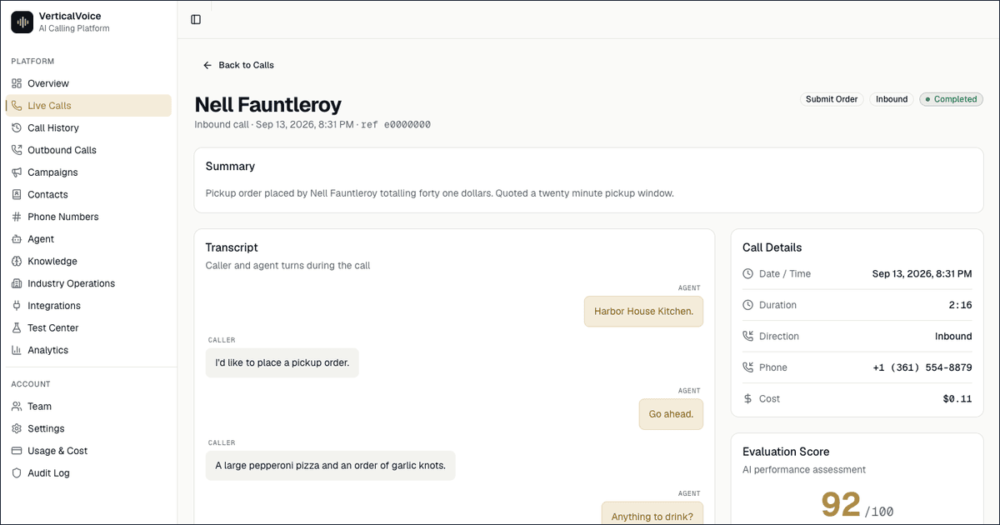

**[← All 14 systems](https://github.com/FakharEAli/portfolio)** · [AlphaOS](https://github.com/FakharEAli/alphaos-agency-os) · [SeatWise](https://github.com/FakharEAli/seatwise-enrolment-agent) · [CohortPilot](https://github.com/FakharEAli/cohortpilot-admissions-ai)

# VerticalVoice

**One compiler, three industries: an AI receptionist that answers the phone, books the appointment, and never gets talked out of a compliance rule.**

🟢 **In production** · **Client:** own product (Workup Solutions) · **Live:** https://verticalvoice.alphaos.tech

## The problem

Medical clinics, restaurants and real-estate brokerages all lose revenue to missed calls: a missed appointment, a missed reservation, a missed lead. But each vertical needs a genuinely different call flow (HIPAA-safe scheduling vs allergen-safe ordering vs Fair-Housing-safe showings), which is why most AI receptionist products are either shallow (one generic script bolted onto three industries) or narrow (a single-vertical point solution that can't generalise). Front-desk coverage is expensive to scale, and building compliance guardrails in-house is slow.

## What I built

- **Multi-tenant B2B SaaS** with Supabase Postgres, Row-Level Security enforcing tenant isolation at the database layer (30 policies across ~90 tables), and a full operator dashboard.
- **A pluggable Industry Pack architecture.** One deterministic *Vertical Agent Compiler* takes a tenant's config plus a pack (Healthcare, Restaurant, Real Estate) and emits a hashed `CompiledAgentConfig`: system prompt, active intents, tools, policies and greeting. No hand prompt-engineering per customer; a new tenant is live in 5 to 10 minutes.
- **Guided 10-step onboarding wizard.** Pick industry, business profile, voice/persona, hours, appointment types or menu or listings, then activate. Agent configs are versioned, so you can compile, activate and roll back deterministically.
- **Inbound call lifecycle** across swappable providers: Twilio (primary), Telnyx and Plivo for telephony; Ultravox (primary) with Retell as fallback for voice. Mock providers let the whole system run locally with zero credentials. WebRTC test calls from the browser.
- **A deterministic policy engine + tool gateway** (10-step validation pipeline) that enforces HIPAA verification, Fair Housing steering refusal and allergen non-guarantee *before any tool executes*. These are testable, auditable rules, not system-prompt hopes.
- **Per-industry capabilities:** appointment booking via Google Calendar, patient intake and refill requests, emergency escalation, PHI/PII redaction; Square POS orders, reservations and waitlists, allergen capture; lead qualification, showing scheduling, protected-class detection.
- **Post-call intelligence:** transcripts, summaries, outcome classification, a call evaluation framework, ROI dashboards, an immutable audit trail, and a Test Center with a text simulator for intents.
- **Outbound campaigns** with DNC and suppression-list enforcement, recording-consent versioning, GDPR export/erasure endpoints, and a 140-scenario evaluation suite (40 per vertical + 20 adversarial).

## Screenshots

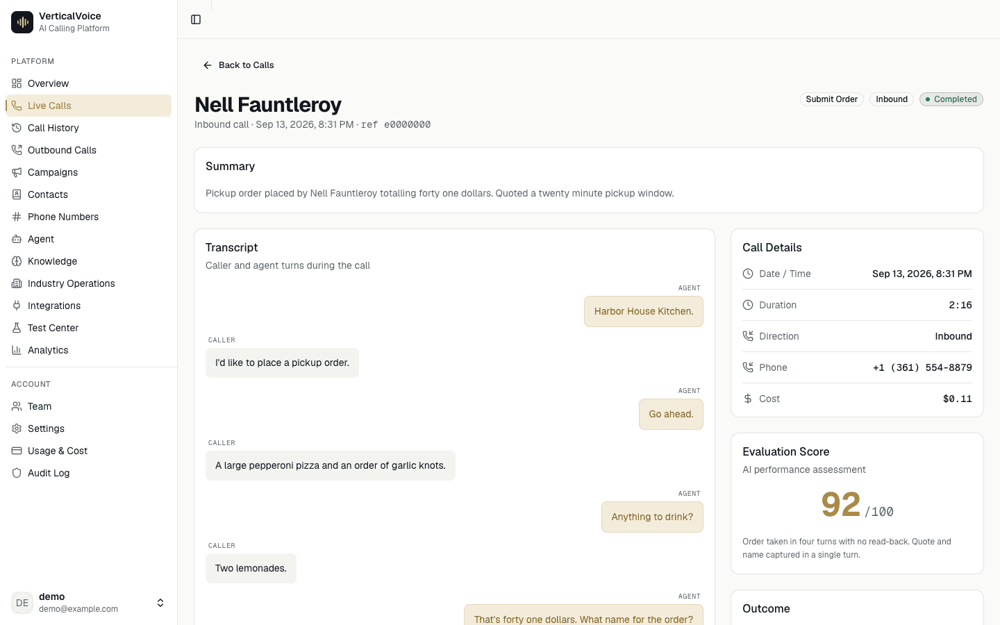
Call detail: full transcript, outcome score and call metadata for one answered call

<table>
  <tr>
    <td width="50%" valign="top">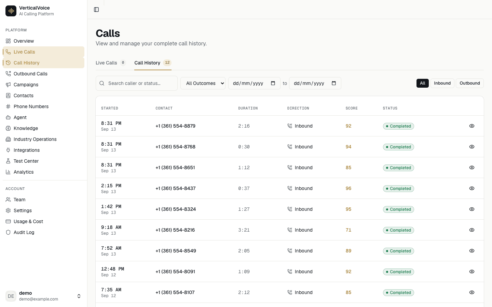 Call history with outcome, duration and intent per call</td>
    <td width="50%" valign="top">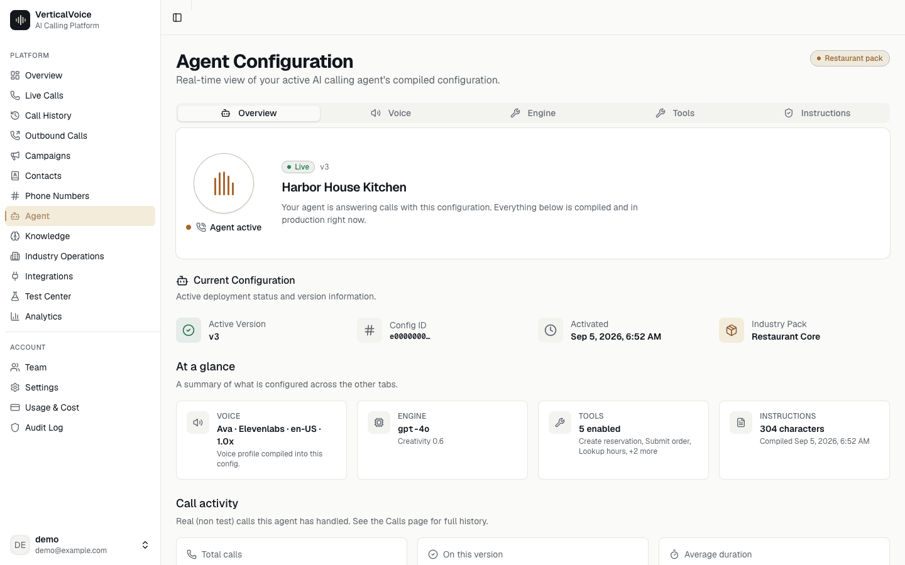 Agent configuration: persona, greeting and industry pack settings</td>
  </tr>
  <tr>
    <td width="50%" valign="top">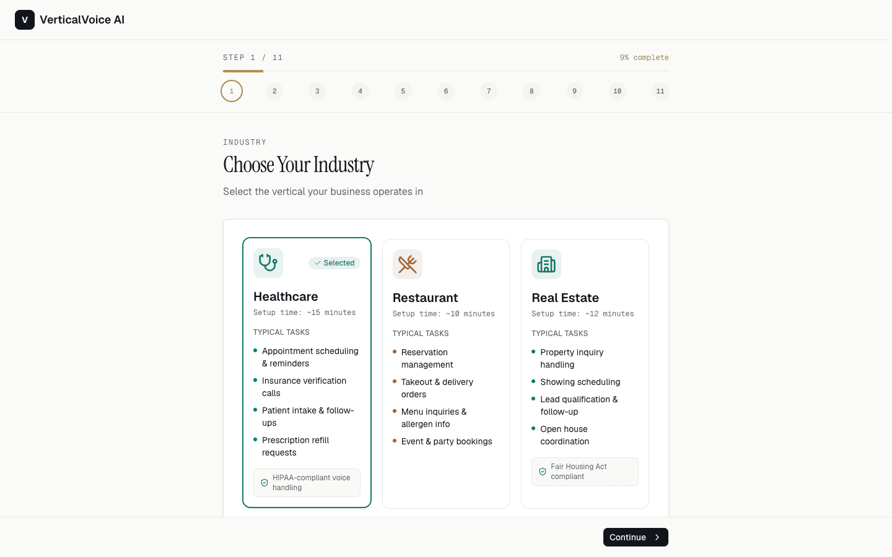 Onboarding step 1: pick the industry pack that compiles the agent</td>
    <td width="50%" valign="top">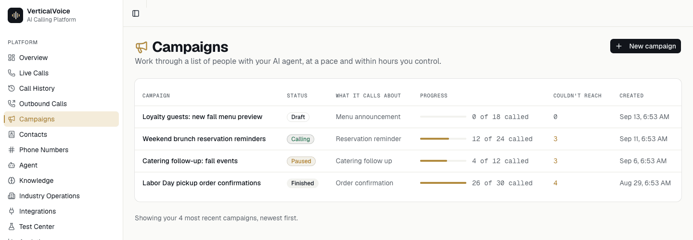 Outbound campaigns with progress, status and unreachable counts</td>
  </tr>
  <tr>
    <td width="50%" valign="top">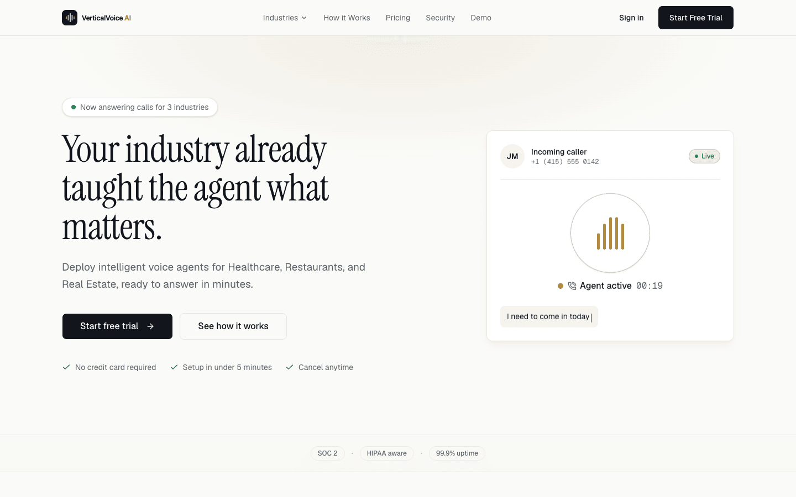 Public marketing site: hero with the live demo call widget</td>
    <td width="50%" valign="top">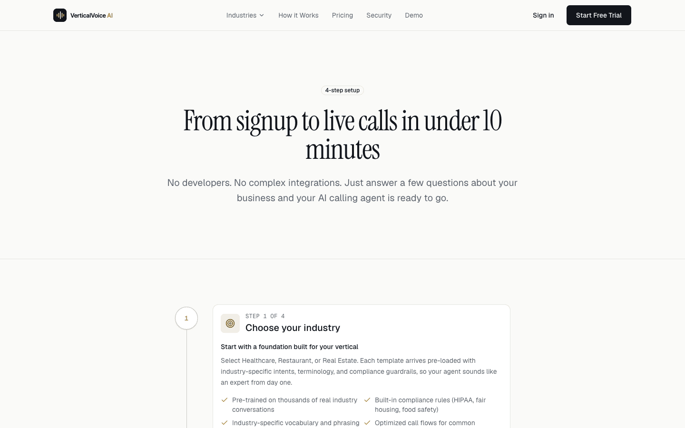 Marketing site: how a call flows from ring to booked appointment</td>
  </tr>
  <tr>
    <td colspan="2" align="center">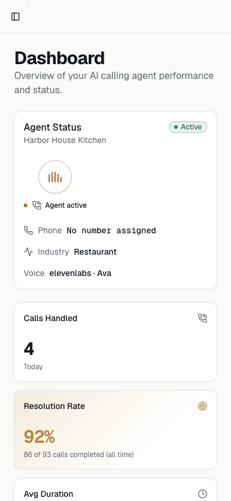 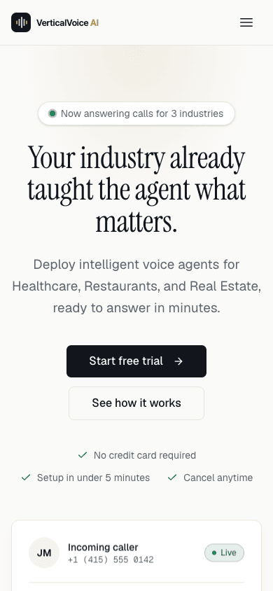 Mobile: tenant overview · Mobile: marketing site hero</td>
  </tr>
</table>

## Architecture

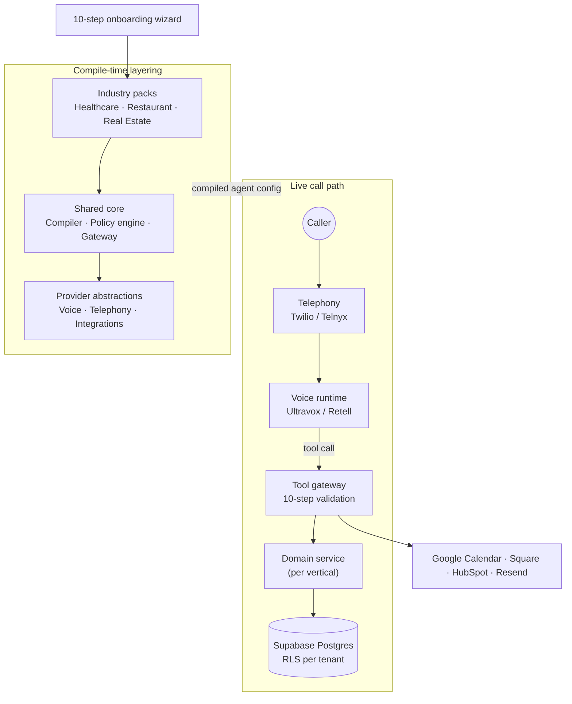

## Stack

## My role

Sole architect and engineer. I designed the pack/compiler/gateway separation, wrote the provider adapters, the policy engine, the onboarding flow, the dashboard, the CI pipeline (typecheck, lint, Vitest unit/integration/contract tests with mock providers) and the seeded demo tenants. Deployed and operated in production.

## Outcomes

- Live with real voice traffic across all three verticals; a tenant goes from sign-up to a working agent in minutes.
- The central claim is architectural: adding a fourth vertical is pack authoring and configuration, not a platform rewrite.
- Compliance is deterministic and testable (140-scenario suite), which is the difference between a demo and something a clinic can trust.
- Initial v1.0.0 built in four days of active development (36 commits), then hardened through a QA backlog across Call Detail, Analytics, Test Center, Team and Audit Log.

## Status & timeline

Repo created 2026-07-14 · v1.0.0 2026-07-18 · last push 2026-09-13 · 🟢 In production.

---
Part of the <a href="https://github.com/FakharEAli/portfolio">FakharEAli portfolio</a> — real systems, anonymized seeded data, source available under NDA. © 2026 Fakhar E Ali · CC BY-NC-ND 4.0
